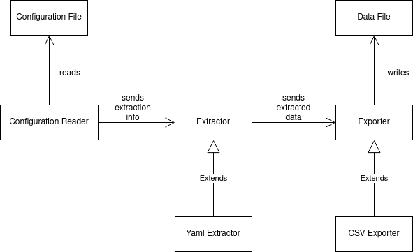
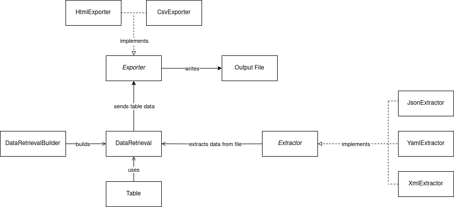
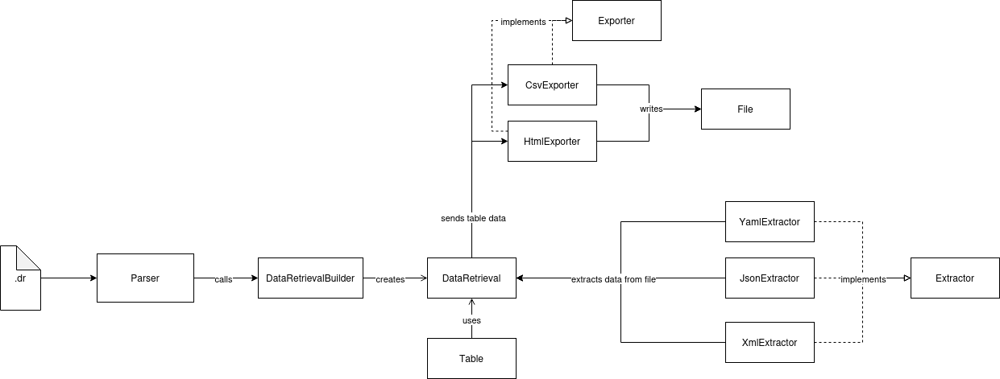

# ELS Project

For this project, you need to [install Gradle](https://gradle.org/install/)

## Project setup

Copy your source files to the ``src`` folder, and your JUnit test files to the ``test`` folder.

## Compile and Running

To compile and install the program, run ``gradle installDist``. This will compile your classes and create a launcher script in the folder ``build/install/els2023-6/bin``. For convenience, there are two script files, one for Windows (``els2023-6.bat``) and another for Linux (``els2023-6``), in the root of the repository, that call these scripts.

After compilation, tests will be automatically executed, if any test fails, the build stops. If you want to ignore the tests and build the program even if some tests fail, execute Gradle with flags "-x test".

When creating a Java executable, it is necessary to specify which class that contains a ``main()`` method should be entry point of the application. This can be configured in the Gradle script with the property ``mainClassName``, which by default has the value ``pt.up.fe.els2023.Main``.

## Test

To test the program, run ``gradle test``. This will execute the build, and run the JUnit tests in the ``test`` folder. If you want to see output printed during the tests, use the flag ``-i`` (i.e., ``gradle test -i``).
You can also see a test report by opening ``build/reports/tests/test/index.html``.

# Testing the External DSL

- All external DSL files meant to complete the assignment operations are located in 'test/pt/up/fe/els2023'
- In order to run each, uncomment the appropriate line in main()
- By default, the uncommented line is the one that runs the assignment 3 code

# Assignment 1

## Semantic Model


## Configuration File
```javascript
{
  "file1": {
    "source": "decision_tree_1.yaml",
    "columns": [
      {
        "key": "params",
        "name": "criterion",
        "rename": "Criterion"
      },
      {
        "key": "params",
        "name": "splitter",
        "rename": "Splitter"
      },
      {
        "key": "params",
        "name": "ccp_alpha",
        "rename": "CPP Alpha"
      },
      {
        "key": "params",
        "name": "min_samples_split",
        "rename": "Min Samples Split"
      }
    ]
  },
  "file2": {
    "source": "decision_tree_2.yaml",
    "columns": [
      {
        "key": "params",
        "name": "criterion",
        "rename": "Criterion"
      },
      {
        "key": "params",
        "name": "splitter",
        "rename": "Splitter"
      },
      {
        "key": "params",
        "name": "ccp_alpha",
        "rename": "CPP Alpha"
      },
      {
        "key": "params",
        "name": "min_samples_split",
        "rename": "Min Samples Split"
      }
    ]
  },
  "file3": {
    "source": "decision_tree_3.yaml",
    "columns": [
      {
        "key": "params",
        "name": "criterion",
        "rename": "Criterion"
      },
      {
        "key": "params",
        "name": "splitter",
        "rename": "Splitter"
      },
      {
        "key": "params",
        "name": "ccp_alpha",
        "rename": "CPP Alpha"
      },
      {
        "key": "params",
        "name": "min_samples_split",
        "rename": "Min Samples Split"
      }
    ]
  }
}
```

## Design Decisions
- Multiple input files supported in the same configuration;
- Each input file is a JSON block;
- Renaming columns is a table operation;
- The name of the input files are stored as if they were data extracted from themselves;
- The tables are referred to using variables;
- The primitives of the model are the object that stores the information obtained from the configuration file, the extractor that reads the data in the input files, the exporter that writes the data to the final table and the table itself.

## External DSL commands for assignment 1

- Does not achieve the assignment's objectives

```
retrieve destination="results/results1.csv" {
    extraction {
        source="assignment_files/assignment1/decision_tree_1.yaml"
        path="params"
        get=["criterion" -> rename="Criterion", "splitter" -> rename="Splitter", "ccp_alpha" -> rename="CCP Alpha", "min_samples_split" -> rename="Min Samples Split"]
    }
    extraction {
        source="assignment_files/assignment1/decision_tree_2.yaml"
        path="params"
        get=["criterion" -> rename="Criterion", "splitter" -> rename="Splitter", "ccp_alpha" -> rename="CCP Alpha", "min_samples_split" -> rename="Min Samples Split"]
    }
    extraction {
        source="assignment_files/assignment1/decision_tree_3.yaml"
        path="params"
        get=["criterion" -> rename="Criterion", "splitter" -> rename="Splitter", "ccp_alpha" -> rename="CCP Alpha", "min_samples_split" -> rename="Min Samples Split"]
    }
}
```

# Assignment 2

## Semantic model


## Configuration File
The configuration file is not supported in this assignment

## Design Decisions
- Internal DSL uses builder pattern
- Different types of extractions from the same file require different configuration definitions
- The extracted data is saved in a Table object that is explicitly defined
- The operations on the data (filtering, sorting, etc.) are performed on the Table

## Builder methods
- `from()` -> sets path from where to extract data
- `to()` -> sets path to where to save data
- `get()` -> sets the keys of the pairs to retrieve
- `fromInFile()` -> sets the path of keys inside the file where the keys to be retrieved are located
- `filter()` -> sets the key that will act as filter to decide what is retrieved
- `max()` -> sets the max flag to retrieve only the pair that presents the maximum value of the key that was defined in filter()
- `min()` -> sets the min flag to retrieve only the pair that presents the minimum value of the key that was defined in filter()
- `build()` -> creates DataRetrieval object, based on configurations set in the builder

### Internal DSL commands for assignment 2
```java
DataRetrievalBuilder builder = new DataRetrievalBuilder();

builder = builder.from("example_files/run1/profiling.json")
	.to("results/results.html")
	.get(keysToExtract) // array of key names
	.fromInFile("functions")
	.filter("seconds")
	.max();

builder = builder.from("example_files/run1/vitis-report.xml")
	.to("results/results.html")
	.get(keysToExtract) // array of key names
	.fromInFile("AreaEstimates/Resources");

builder = builder.from("example_files/run1/decision_tree.yaml")
	.to("results/results.html");

builder = builder.from("example_files/run1/decision_tree.yaml")
	.to("results/results.html")
	.fromInFile("params");

DataRetrieval dataRetrieval = builder.build();

dataRetrieval.execute();
```

## External DSL commands for assignment 2

- Achieves the assignment's objectives, with one exception: extracts two fields from decision_tree.yaml that are not root level; it also requires the "get" array as it is in profiling.json, or the extraction will fail

```
retrieve destination="results/results2.html" {
    extraction {
        source="assignment_files/assignment2/decision_tree.yaml"
    }
    extraction {
        source="assignment_files/assignment2/decision_tree.yaml"
        path="params"
    }
    extraction {
        source="assignment_files/assignment2/profiling.json"
        path="functions"
        get=["time%" -> rename="% #"N, "name" -> rename="name #"N]
        filter="time%"
        top=1
    }
    extraction {
        source="assignment_files/assignment2/vitis-report.xml"
        path="AreaEstimates/Resources"
    }
}
```

# Assignment 3

## Semantic model


## Builder methods
- `from()` -> sets path from where to extract data
- `to()` -> sets path to where to save data
- `get()` -> sets the keys of the pairs to retrieve
- `rename()` -> sets the names with which to rename the extracted keys when these are added to the table
- `renameAll()` -> used when there is a global rename rule
- `filterRelatedRename()` -> used when there is a rename that depends on a filter
- `fromInFile()` -> sets the path of keys inside the file where the keys to be retrieved are located
- `filter()` -> sets the key that will act as filter to decide what is retrieved
- `top()` -> sets the configuration to extract the top n values of the parameter set by filter()
- `bottom()` -> sets the configuration to extract the bottom n values of the parameter set by filter()
- `sumOf()` -> sets the flag to add a row with the sum of all values of a column 
- `averageOf()` -> sets the flag to add a row with the average of all values of a column
- `end()` -> to use after a configuration ends for purposes of readability
- `build()` -> creates DataRetrieval object, based on configurations set in the builder

## External DSL commands for assignment 3

- Achieves the assignment's objectives

```
retrieve destination="results/results.html" folder="assignment_files/assignment3" {
    extraction {
        source="analysis.yaml"
        path="total/results/dynamic"
        append=" (Dynamic)"
    }
    extraction {
        source="analysis.xml"
        path="total/results/static"
        append=" (Static)"
    }
    extraction {
        source="profiling.json"
        path="functions"
        get=["time%" -> rename="% #"N, "name" -> rename="name #"N]
        filter="time%"
        top=3
    }

    operation {
        sum=all
    }
    operation {
        average=all
    }
}
```
